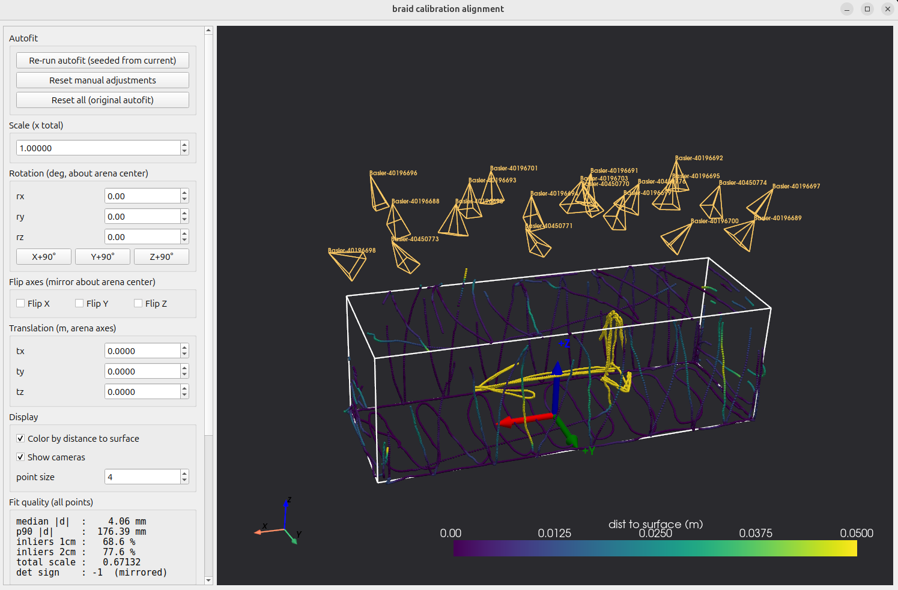

# Calibration alignment tool

Aligns an **unaligned** MCSC (multi-cam-self-cal) camera calibration to your real arena coordinates.
This replaces the manual `flydra_analysis_calibration_align_gui` step: it
automatically finds the rotation, scale, and translation that best maps your
wand-tracing data onto the arena geometry, lets you verify and fine-tune the
result in a live 3D window (including axis flips), and saves a new standalone
calibration XML that braid can load directly.

## Where this fits in the workflow

1. Checkerboard-calibrate each camera (ROS or braid/strand).
2. Record an LED-wand `.braidz` and run the braidz-mcsc multicamselfcal
   routine → you now have an **unaligned calibration XML**. *(You are here.)*
3. **Record an arena-tracing dataset** with the unaligned calibration loaded
   in braid: wave the LED wand along the outside edges and surfaces of the
   arena, and also "draw" three perpendicular arrows in the middle of the
   space pointing in the directions you want to be +x, +y, and +z.
4. **Run this tool** (below) → aligned calibration XML.

## Files you need before running

| # | File | What it is | Example (in this directory) |
|---|------|------------|------------------------------|
| 1 | `*-unaligned.xml` | The unaligned calibration produced by the mcsc routine (`<multi_camera_reconstructor>` schema) | `example_calibration_data/20251120_calibration/unaligned/20251121_134739-unaligned.xml` |
| 2 | `*.braidz` | The **arena-tracing** dataset from step 3 above — recorded *with the unaligned calibration loaded* | `example_calibration_data/20251120_calibration/aligned/20260706_120045.braidz` |
| 3 | `*_stim.xml` | Arena geometry: a flydra-style stimxml with a `<cubic_arena>` block listing the 8 corner vertices of your arena box, in meters, in the coordinates you want | `example_calibration_data/bigwindtunnel_stim.xml` |

Notes:
- File 2 is **not** the wand dataset you used for mcsc (file 1's dataset) — it
  is a *new* recording that traces the arena edges/surfaces + the three arrows.
- File 3 defines your target coordinate system. Look at
  `bigwindtunnel_stim.xml` for the format — 8 `<vert>x, y, z</vert>` lines.

## One-time setup

```bash
pip install --user --break-system-packages "pyvista>=0.44" "pyvistaqt>=0.11"
```

(`numpy`, `scipy`, `pandas`, and `PyQt5` are also required but are already
present on a machine that runs the rest of `braid_tools`.)

Sanity check the installation:

```bash
python3 align_core.py --selftest    # should print PASS for every check
```

## Run it

From this directory:

```bash
python3 align_calibration.py \
    --unaligned-xml PATH/TO/your-unaligned.xml \
    --braidz PATH/TO/arena_tracing.braidz \
    --stimxml PATH/TO/your_arena_stim.xml
```

Working example using the reference data in this repo:

```bash
python3 align_calibration.py \
    --unaligned-xml example_calibration_data/20251120_calibration/unaligned/20251121_134739-unaligned.xml \
    --braidz example_calibration_data/20251120_calibration/aligned/20260706_120045.braidz \
    --stimxml example_calibration_data/bigwindtunnel_stim.xml
```

The tool auto-fits the transform (a few seconds) and opens a 3D window:
white arena wireframe, your wand data colored by distance-to-surface
(dark = good), a simple wireframe model for every camera, and red/green/blue
arrows at the arena origin showing +X, +Y, +Z.



*(The bright yellow strokes in the middle are the drawn axis arrows — far from
the walls by design, and ignored by the fit.)*

## In the GUI: what to check before saving

The automatic fit gets the *shape* right, but if your arena cross-section is
square (e.g. y and z spans are equal), geometry alone cannot tell the axes
apart or know their signs. **That is what your drawn arrows are for.**

1. **Rotate/zoom** the view (left-drag / scroll) and confirm the data hugs the
   white box: floor on the floor, walls on the walls, mostly dark-colored
   points. The three interior arrow strokes will show up bright yellow —
   that's expected (they are far from the surfaces).
2. **Find your drawn arrows** in the middle of the cloud and compare them to
   the red/green/blue +X/+Y/+Z arrows at the origin. If they don't match, use
   the **Flip X/Y/Z** checkboxes and **X/Y/Z +90°** buttons until they do.
   These hop between equivalent box alignments, so fit quality is unaffected.
3. Optionally fine-tune with the scale / rotation / translation spinboxes, or
   press **"Re-run autofit (seeded from current)"** to re-optimize from your
   current orientation (it keeps the axis branch you chose).
4. Watch the **Fit quality** panel — on a good dataset expect a median
   distance of a few mm and most points within 1–2 cm.
5. Press **Save aligned XML**. Saving runs automatic checks (the transformed
   cameras must reproject identically to the originals, and the written file
   must round-trip); if a check fails, nothing is written and the reason is
   shown in red.

## Output

Saved next to the input XML by default (override with `--output`):

- `<name>-aligned.xml` — the aligned calibration, same schema as the input.
  Load this in braid.
- `<name>-aligned.transform.json` — the 4×4 transform, its
  scale/rotation/translation decomposition, fit-quality metrics, and the
  manual adjustments you made. Keep it with the calibration for provenance;
  you can also reload it later with `--transform-json`.

## Other options

```text
--no-gui              headless: autofit, run checks, save XML + JSON + a PNG
                      snapshot of the scene. WARNING: axis flips/90° choices
                      are arbitrary in this mode — only use it when you'll
                      verify the axes some other way.
--transform-json F    skip autofit and start from a previously saved transform
--output PATH         where to write the aligned XML
--force               allow overwriting an existing output file
--max-fit-points N    subsample size for the optimizer (default 8000)
--seed N              random seed for subsampling
```

## Troubleshooting

- **The 3D window is blank or garbled** (Wayland sessions): relaunch with
  `QT_QPA_PLATFORM=xcb python3 align_calibration.py ...`
- **"all autofit starts collapsed"**: the dataset probably doesn't actually
  trace the arena surfaces (too short, wand stayed in the middle, or wrong
  braidz file). Check you passed the arena-tracing recording, not the mcsc
  wand recording.
- **Fit looks rotated 90° or mirrored**: that's the expected axis ambiguity —
  fix it with the Flip / +90° controls (step 2 above), not by re-recording.
- **`det sign : -1 (mirrored)` in the metrics panel**: normal. MCSC
  calibrations are sometimes mirror-imaged; the tool handles this and the
  saved calibration is valid.
- **Poor fit quality everywhere** (median off by cm even on walls): make sure
  the stimxml vertices match your physical arena dimensions in meters.

## How it works (short version)

The tool finds a similarity transform `X' = s·R·X + t` (reflections allowed)
that minimizes a robust (outlier-trimmed) distance from each wand point to the
**surface** of the arena box — the interior arrow strokes are automatically
ignored by the robust loss. It multi-starts over all box symmetries, including
mirrored ones. Each camera matrix is then transformed as `P' = P·M⁻¹`, which
leaves every reprojection pixel-identical, and written back out in the same
XML schema with the per-camera distortion parameters passed through untouched.
`align_core.py` contains all of this and is importable; `align_calibration.py`
is the CLI/GUI wrapper.
